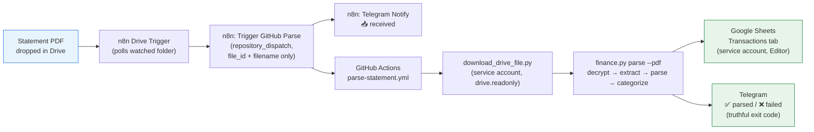

# krimRakOra — Project Wiki

A human-readable history and knowledge base for this project. `CLAUDE.md` is the
machine-context file Claude reads at the start of every session (status table, file index,
conventions); this file is the narrative version — what the project is, why it exists, and how
it got to where it is. Update it when something worth remembering happens; it's fine for this to
lag CLAUDE.md's session-by-session detail.

---

## What this project is

A zero-recurring-cost personal finance controller for an India-based user currently in an active
credit-card debt payoff phase. It tracks every transaction across 4+ credit cards, converts
foreign-currency spend to INR, categorizes spend automatically, runs a hybrid avalanche+snowball
debt payoff plan, and produces monthly net-worth and spend reports — all without paying for any
new SaaS. The whole stack is: Python parsers → Google Sheets (as the database) → n8n Cloud (free
tier automation) → Telegram (the interface).

The "why zero recurring cost" constraint isn't incidental — it's a first-class design rule. Any
proposal that introduces a paid service gets rejected on sight unless there's no free alternative
(see "Decisions" below for the one time this was tested).

## How it's built, phase by phase

**Phase 0–1 (done):** Project scaffolding, Google Sheets with 9 tabs, and five bank-specific
statement parsers (ICICI, RBL, SBI, Scapia, Kotak), each converting a statement into the same
unified transaction schema.

**Phase 1.5–1.7 (done):** The parsers originally expected clean markdown input, but real
statements arrive as password-protected PDFs. Three modules closed that gap: PDF decryption
(pure Python, no third-party API — the statement text never leaves the machine), PDF-to-markdown
extraction (one regex-based extractor per bank, each with its own quirks — see "Bank-specific
gotchas" below), and CLI wiring so `finance.py parse --pdf <file>` goes from an encrypted PDF
straight to a Google Sheets row in one command.

**Phase 2 (n8n WF1 — automating statement ingestion, done 2026-08-02):** A statement PDF lands in
a watched Google Drive folder, n8n notices it, tells GitHub Actions which file to grab, GitHub
Actions downloads it, decrypts and parses it, writes to Sheets, and Telegram confirms. Getting
there took three real attempts (see "Decisions" and the CLAUDE.md session notes for 2026-08-01
and 2026-08-02) — a wrong-design workflow, a GitHub API payload bug, an unpushed-commit scare, a
literal tab character silently breaking the whole GitHub Actions workflow file, and a Google
Sheet the write service account was never actually shared on. Verified end-to-end with a real
statement on 2026-08-02: 60 real transaction rows landed in the Transactions sheet from a genuine
Drive-upload-to-Telegram-confirmation run.

**Phase 3 (n8n WF3/4/5 — WF3+WF4 done, WF5 not started):** Scheduled jobs — daily FX
rate sync, daily spend summary to Telegram, monthly report generation. WF3 (daily FX sync, 6am
IST) fetches rates for 8 currencies and appends them to the `FX_Rates` sheet, with a fallback
branch that carries forward yesterday's rates and alerts on Telegram if the API call fails.

```mermaid
flowchart LR
    A["Schedule Trigger\n30 0 * * * (6am IST)"] --> B["HTTP GET\nexchangerate-api.com"]
    B -->|success| C["Code: parse & compute\nrate_to_inr, 8 currencies"]
    B -->|error| D["Sheets Read\nlast known rates"]
    C --> E["Google Sheets\nFX_Rates tab (append)"]
    D --> F["Code: carry forward\nyesterday's rates"]
    F --> E
    F --> G["Telegram\n⚠ sync failed, using\nyesterday's rates"]

    style A fill:#1a2b22,stroke:#3ecf8e
    style E fill:#1a2b22,stroke:#3ecf8e
    style G fill:#2b2416,stroke:#e8b64c
```

Getting there took one real bug: the Sheets Append node's `appendOrUpdate` operation, matched on
`(date, currency_code)`, behaved like a date-only match in practice — since all 8 currencies in a
batch share the same date, each one silently overwrote the previous one's row instead of inserting
its own, losing data (a missing USD row, a duplicated JPY row) despite the execution reporting
success. Caught by independently re-reading the sheet rather than trusting the green execution
status — the same lesson WF1 taught with its false-success Telegram messages. Fixed by switching
to a plain `append` (upsert semantics weren't actually needed for a once-daily job). See
`CLAUDE.md`'s `## Session: 2026-08-02 (cont.) — WF3 built & verified` for full detail.

WF4 (daily spend summary, 9pm IST) reads today's Transactions and this month's Budget, aggregates
spend by budget_type, flags any category over 80% of its weekly allocation, and sends a Telegram
digest (or a "no spend today" message).

```mermaid
flowchart LR
    A["Schedule Trigger\n30 15 * * * (9pm IST)"] --> B["Sheets Read\nBudget tab"]
    B --> C["Sheets Read\nTransactions tab\n(executeOnce: true)"]
    C --> D["Code: aggregate by\nbudget_type, flag >80%\nweekly spend"]
    D --> E{"has_transactions?"}
    E -->|yes| F["Telegram\n📊 daily digest"]
    E -->|no| G["Telegram\n✓ no spend today"]

    style A fill:#1a2b22,stroke:#3ecf8e
    style F fill:#1a2b22,stroke:#3ecf8e
    style G fill:#1a2b22,stroke:#3ecf8e
```

Three real bugs surfaced during testing, none visible from a green execution alone. First, a
schema mismatch caught *before* any node was built: an `llm-council` review (run at the user's
request) diffed the skill runbook's Code node against CLAUDE.md's own schema table and found it
aggregating on `needs/wants/savings` (plural) when the sheet actually stores
`need/want/save/debt/petty` (singular) — unfixed, three of five categories would have silently
read ₹0 forever. Second, wiring the two Sheets Read nodes in parallel into the Code node raced:
n8n fires a node as soon as its *first* predecessor finishes, not all of them, so the Code node ran
before Budget had loaded. Fixed by chaining them sequentially. Third — and introduced by that very
fix — once the Budget sheet had 5 real rows, the downstream Transactions read re-executed once
*per incoming Budget item* (n8n's default fan-out behavior), inflating every total by exactly 5x.
Diagnosed by counting: 5 output rows to Budget, 5x inflation, no coincidence. Fixed with
`executeOnce: true`. Verified clean afterward with a real ₹500 test transaction and its deletion,
confirming both the digest and the no-spend paths against hand-summed real data — not just a
plausible-looking Telegram message. See `CLAUDE.md`'s `## Session: 2026-08-09 — WF4 built &
verified` for full detail.

**Phase 4 (done):** Debt payoff planning (hybrid avalanche/snowball, pays off small balances
first for psychological wins, then attacks highest-interest debt) and net worth tracking.

**Phase 5 (done):** Test hardening — 87 tests, all passing.

**WF2 (Telegram AI agent — not started, deliberately last):** A conversational interface over
the data (quick-add transactions, ask budget questions) using Claude Haiku. Scheduled last
because it's the highest-effort, lowest-urgency piece — the core pipeline (statement in, row in
Sheets out) has to be trustworthy before a chat layer sits on top of it.

## Decisions worth remembering

**Rejected: the Supabase/LlamaParse/Next.js pivot (2026-07-06).** Partway through, a much
heavier redesign was floated — a hosted FastAPI decrypt service, LlamaParse/OpenAI for
extraction, a Supabase database, a LangChain text-to-SQL agent, and a Next.js frontend. It was
red-teamed and rejected: it introduces recurring cost the debt-kill phase doesn't want, it would
ship full bank statement text to third-party APIs (violating the standing rule to strip
statement text before any Claude API call, let alone an unrelated third party), and it largely
duplicates work already done and tested (the parsers, Sheets-as-database, Telegram-as-interface).
The one thing kept from the proposal was its discipline — build one module at a time, test before
moving on — which was already consistent with how the project works.

**Rejected: financial data connectors and Cowork's finance plugins (2026-08-01).** An LLM council
review raised the question of whether Plaid-style bank connectors, or Cowork's "finance" /
"financial-analysis" plugins, were worth adopting. Both were evaluated and rejected for the same
underlying reason as the Supabase pivot: they're built for corporate or investment-banking
workflows (portfolio analysis, institutional reporting), not personal debt tracking, and they'd
introduce third-party access to financial data and/or recurring cost that the existing
statement-PDF pipeline avoids entirely.

**Approved instead:** keep extending the existing free stack. This has held for the whole project
so far — every phase builds on Sheets + n8n + Telegram + local Python rather than replacing any
of them.

## Bank-specific gotchas (useful if adding a new card later)

Each bank's PDF text extraction turned out to have its own edge case, discovered only by
inspecting real (not synthetic) statement text:

- **ICICI** — reward/amount text can bleed together from the statement's chart legend; the
  extractor takes the *last* match in each blob rather than the first.
- **RBL** — the raw extracted text drops the visual "CR" credit marker entirely; credits are
  instead detected by keyword (PAYMENT, CASHBACK, REFUND, etc.).
- **SBI** — EMI instalment IGST lines print with no date of their own in the raw text (they're a
  PDF sub-line of the prior transaction) and had to be attached back to that transaction's date
  carefully, without false-matching the statement's terms-and-conditions footer.
- **Scapia** — merchant names run together with no spaces in the raw extracted text, and a
  repeated page-header block interleaves at every page break.
- **Kotak** — the one true surprise: EMI-converted purchases are *reversed* in the same statement
  by a matching negative line, so counting both would double-count spend. This is the *opposite*
  of how ICICI and Scapia handle EMI (they count the full purchase once, and the EMI breakdown is
  just informational). Verified against the statement's own printed totals — always do this for
  any new EMI-handling bank rather than assuming the last bank's pattern holds.

**Axis and Emirates NBD were dropped from scope** — the Axis files turned out to be
savings-account statements with zero transactions (no actual Axis credit card in use), and
Emirates NBD was confirmed unnecessary by the user.

## What tripped things up operationally

- **iCloud sync slowness.** The project folder lives under a Documents path with iCloud
  "Desktop & Documents Folders" sync on, which lazily fetches files and caused severe slowness
  (and, separately, "cloud placeholder" errors when Claude tried to read files that iCloud hadn't
  downloaded locally yet). The virtual environment was moved out of the synced folder as a fix;
  `brctl download` is the recurring workaround for placeholder files.
- **A near-miss with two months of unpushed work.** On 2026-08-01, routine verification turned up
  that the last several weeks of real feature work — PDF decryption, all five bank extractors,
  the debt/net-worth modules, the WF1 redesign — existed only in the local working tree and had
  never been pushed to GitHub. This is why GitHub Actions kept silently running an old version of
  the parse workflow no matter what got "fixed" locally. Recovered by carefully staging and
  pushing a curated commit. Worth treating as a standing lesson: check `git status` against
  `origin/main` periodically, not just when something breaks.
- **The n8n MCP connector's `update_workflow` tool is unreliable — confirmed broken three separate
  times** (2026-08-01, twice on 2026-08-02) with the same `settings must NOT have additional
  properties` error, regardless of payload. `create_workflow` (for brand-new workflows) works
  fine and was used to build WF3. Any *edit* to an existing workflow still has to go through the
  n8n UI by hand, with a `get_workflow` re-fetch afterward to confirm it actually saved — never
  trust a UI "done" on its own.

## Current state and what's next

As of 2026-08-09, the statement-ingestion pipeline (WF1), the daily FX sync (WF3), and the daily
spend summary (WF4) are all done and verified. WF1: a real statement PDF dropped in Drive goes all
the way to a real row in the Transactions sheet and a truthful Telegram confirmation, with no
manual steps in between. WF3: a daily 6am IST cron (active in n8n) fetches and writes 8 currencies'
INR rates to the `FX_Rates` sheet, with a tested-but-not-yet-fired fallback path for API failures.
WF4: a daily 9pm IST cron (active in n8n) reads today's spend and this month's Budget, and sends a
truthful Telegram digest — verified against real hand-summed data on both the has-spend and
no-spend paths. Next up, per the 2026-08-01 council review's ordering: **WF5 (monthly report)**,
then WF2 (Telegram AI agent) last. See `CLAUDE.md`'s `## Session: 2026-08-02`,
`## Session: 2026-08-02 (cont.) — WF3 built & verified`, and
`## Session: 2026-08-09 — WF4 built & verified` sections for full detail, including follow-up items
worth doing next time someone's in the n8n UI or Google Sheets: hard-deleting the already-archived
dead WF1 duplicate, exercising WF3's and WF4's untested error/warning branches for real, and
tightening the Transactions sheet's "anyone with the link can edit" sharing setting.
